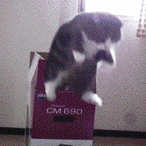
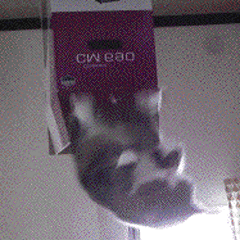

# 👋 我是 Eric Huang，一个很菜的初学者——总之留下你的⭐
### I'm Eric Huang, a beginner who's not very good — anyway, leave your ⭐!

🎓 **东北电力大学** · 计算机科学  
🔬 雷达脉冲去交错 · LLM 可解释性 · AI4Science

---

### 🤺 About Me

- 🎓 东北电力大学 · 计算机科学与技术
- 🔬 Research: 雷达脉冲去交错 · LLM 可解释性 · AI4Science
- 💻 Stack: Python / PyTorch / C++ / JS / Docker / Linux
- 🤖 AI 工具重度用户：Claude Code · Ollama · ComfyUI
- 📝 Blog: 暂无

---

### 🚀 Featured Projects

#### 🎯 雷达去交错 V5.1B
> HDBSCAN + GMM 无监督雷达脉冲解交错，零训练部署

#### 📄 DocU
> PDF → DOCX 高保真转换器，基于 MinerU

#### 🛡️ IFF 火控敌我甄别
> 末段拦截敌我信号识别，100% 检出率

#### 🔑 RAD-Scale
> LLM 语义密钥八定律，arXiv 投稿中

#### 🤖 AgentOS
> AI 原生操作系统，21 模块 + 99 测试

#### 💬 MOSS Bot
> 飞书群 OpenClaw 机器人，@ 交互 + 视觉能力

---

### 🛠️ Tech Stack

#### Languages & Frameworks

#### AI & ML

#### Tools & Platforms

 

---

### 📊 GitHub Stats

---

### 🐍 Contribution Snake

<picture>
  <source media="(prefers-color-scheme: dark)" srcset="https://cdn.jsdelivr.net/gh/Eric-huang799/Eric-huang799/snk/github-contribution-grid-snake-dark.svg" />
  <source media="(prefers-color-scheme: light)" srcset="https://cdn.jsdelivr.net/gh/Eric-huang799/Eric-huang799/snk/github-contribution-grid-snake.svg" />
  
</picture>

---

### 🌐 Connect With Me

💬 想交流技术或合作项目？欢迎来 [Issues](https://github.com/Eric-huang799/Eric-huang799/issues) 留言，我会尽快回复。

---

